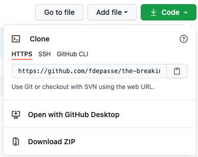
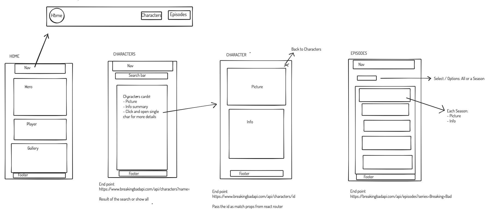
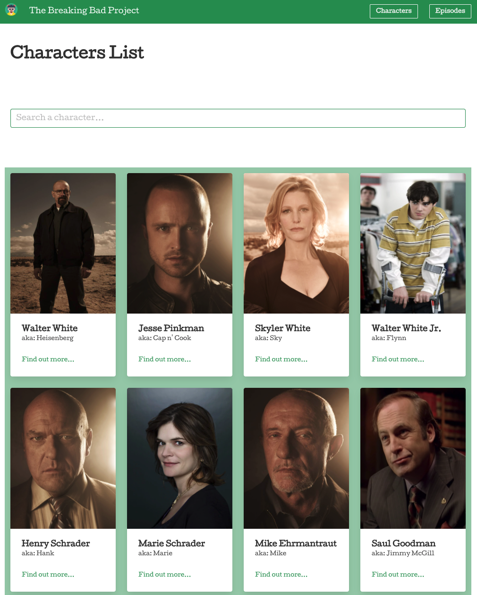
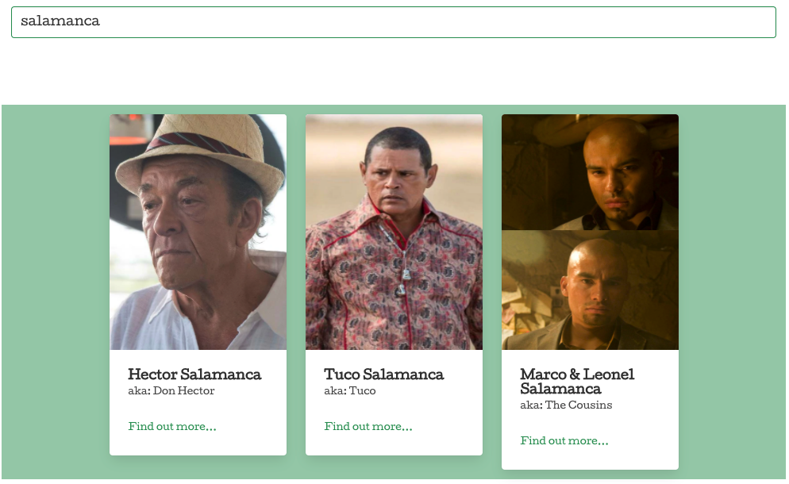
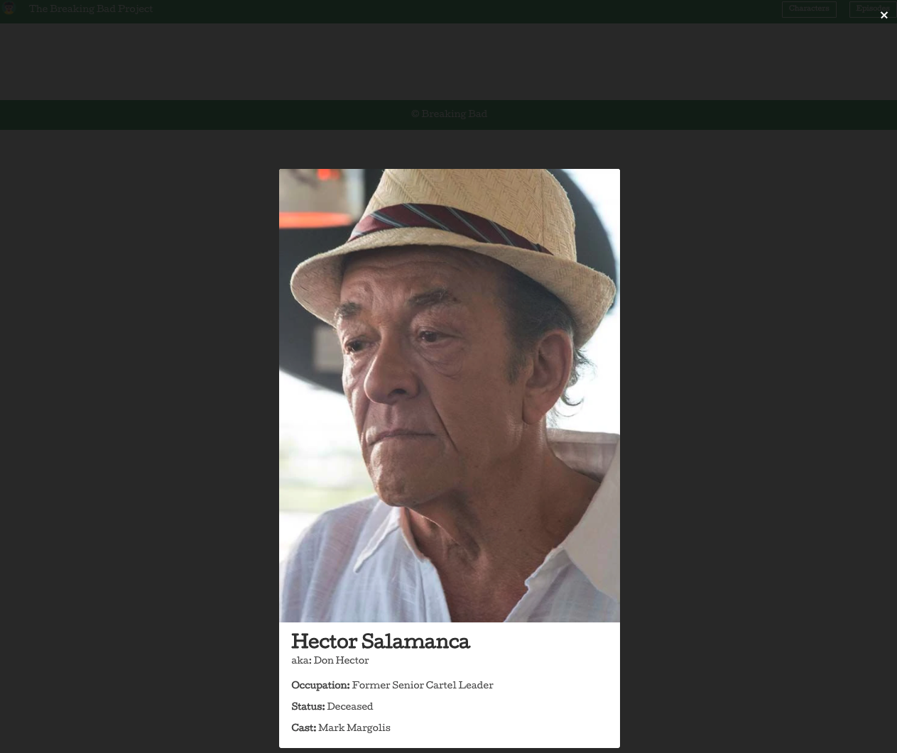
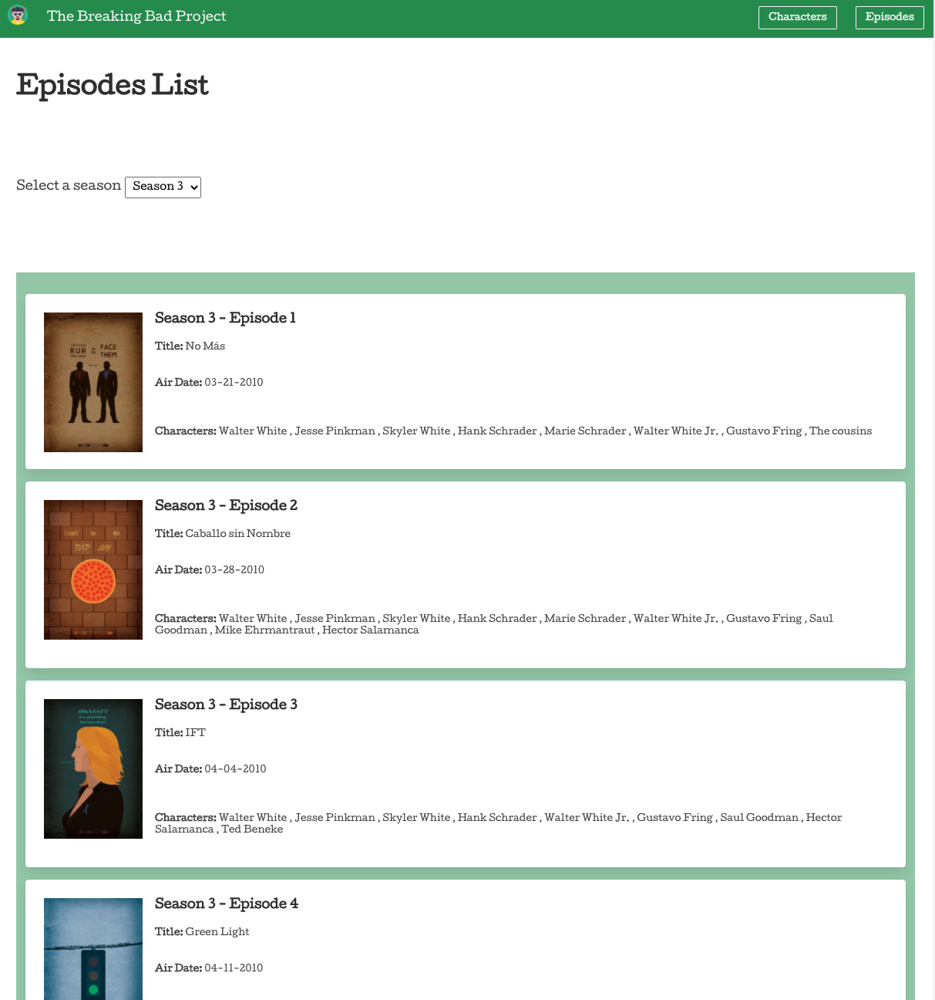

# <p><span>The Breaking Bad Project</span></p>

<br/><br/>

<p align="center"></p>

<br/><br/>

## Table of Contents
* [Overview](#overview)
* [Getting Started](#getting-started)
* [Project Brief](#brief)
* [Technologies Used](#technologies)
* [Team Responsibilities](#team)
* [Approach](#approach)
* [Enhancements](#enhancements)
* [Wins, Challenges & Learnings](#wins-and-challenges)

<br/>

## <a name="overview"></a>Overview
This was the second project from the Software Engineering Immersive Course I took at General Assembly London, built after 6 weeks of class.

It was a **pair programming** project in the form of a **2 days** Hackathon.

The application is a tribute to the Breaking Bad series allowing visitors to look at various artistic illustrations of the show, browse the characters and the episodes.

It is a frontend application built with React JS and talking to a Public API, implementing AJAX principles with JavaScript. It has been deployed via GitHub.

>Access the **app** [here](https://fdepasse.github.io/the-breaking-bad-project/) and the **repository** [here](https://github.com/fdepasse/the-breaking-bad-project)


<br/>


## <a name="getting-started"></a>Getting Started
Click the "Code" button on the [repository](https://github.com/fdepasse/pacman-thriller) and choose either to **Clone** it or to **Download ZIP** the files.
<p align="center"></p>
Once the files are on your machine, from the directory they are saved run `npm i` to install the dependencies from the package.json followed by `npm run serve` to start webpack dev server and see the app locally in your browser.

<br/>

## <a name="brief"></a>Project Brief
* Consume a public API
* Have several components
* The app should include a router - with several "pages"
* Include wireframes - that you designed before building the app
* Have semantically clean HTML - you make sure you write HTML that makes structural sense rather than thinking about how it might look, which is the job of CSS
* Be deployed online and accessible to the public

<br/>

## <a name="technologies"></a>Technologies Used

### Frontend
* React JS
* React Router
* React Player
* Bulma
* Sass
* Google Fonts
* Node.js
* Webpack
* NPM
* Axios
* Babel
* Lodash

### Development tools
* VS Code & Live Share
* Git
* GitHub (including deployment)
* Google Chrome Dev Tools
* Zoom
* Slack

### API
* [The Breaking Bad API](https://breakingbadapi.com/documentation)

<br/>


## <a name="team"></a>Team Responsibilities
* [Fabien Depasse](https://github.com/fdepasse): Characters, Character and Header components, Home page hero section
* [Abdi Osman](https://github.com/aozzy): Characters Search Bar, Episodes and Footer Components, Home page video player and gallery


<br/>

## <a name="approach"></a>Approach
### Step 1: Whiteboarding


#### Problem #1: Deciding on our App Functionalities

After looking at API End Points and understanding the data available, we decided on the below features: 

* Browsing all characters from the series and getting some information about them
* Searching characters
* Broswing all episodes from the series and filtering by season

We also wanted to be able to play a trailer and display a gallery of images from our homepage.

<br/>

#### Problem #2: Deciding on the UI
We whiteboarded the pages we wanted to display from a UI point of view. From there, we have broken down the project into React Components to build. For each of the component, we indicated where we would need the API endpoints we chose. Finally we decided on the navigation between pages with React Router. 

<p>

<br/>

<hr/>

### Step 2: Developing the App


#### Problem #1: Displaying all characters and being able to search them
We stored in state the **characters data** returned from our API and the **search input** from the user because we expect to re render our page each time these change.
 
```
const [characters, updateCharacters] = useState([])
const [filter, updateFilter] = useState('')
```

When the component mounts, a `useEffect` hook calls `debouncedSave(filter, updateCharacters)` function. The function takes a `query` argument which is the search input from the user we have stored in state. We use the `query` to update the end point URL and make a request to the API for the relevant characters. We passed `updateCharacters` to the function so we could call it and pass the data returned from the API to it, meaning the result of the search is now stored in state `character`. 

```
const debouncedSave = debounce((query, updateCharacters) => {
  axios.get(`https://www.breakingbadapi.com/api/characters?name=${query}`)
    .then(resp => {
      updateCharacters(resp.data)
    })
}, 500)
```
> `_.debounce(func, [wait=0], [options={}])` is a special function from the Lodash library. It delays invoking a function (func) after a period in ms (wait) starting from the last time it has been invoked. In our case, it is avoiding the user making a request to the API each time a letter is entered in the search bar.

We got an array back from the API which we first filtered on the frontend to only be characters from Breaking Bad (API also covers Better Call Saul Series) and second we mapped over each characters to display them as cards using Bulma classes.

```
{characters.filter(character => {
          return character.category.includes('Breaking Bad')
        }).map(character => {
          return <div key={character.char_id} className="column is-one-quarter-desktop is-one-third-tablet is-full-mobile">
            <div className="card">
...
})
```
<br/>

*Characters Page*
<p>

<br/>

*Searching*
<p>

<br/>

#### Problem #2: Showing more info about one particular character from the characters page
When the user clicks "Find out more..." on one of the characters' card, the `Character` component mounts and renders on the page, displaying more information about the character to the user. To achieve so, we used the react-router `<Link/>` feature. Each character card has a `<Link/>` with a path leading to the individual `Character` component. Part of this path is dynamic and holds the id of the character. 

```
}).map(character => {
   ...
<Link to={`/the-breaking-bad-project/characters/${character.char_id}`} className="is-size-7">Find out more...</Link>
...
})
```  

The `<Link/>` feature comes with a `match` object which contains information about how our link matched the URL of the single character page: in our case the id. The dynamic segment of the path is stored under a property of the match object called `params`. We then passed `match` as props to the `Character` component to access the character id on the other side.

```
export default function Character({ match }) {
  const id = match.params.id
...
  }
```

With the id available in our single `Character` component, we udpate the URL of our API end point and make a request for the relevant character in a `useEffect` hook when the component mounts. We then store the character data in state and can use it to display it on the page.

```
  useEffect(() => {
    axios.get(`https://www.breakingbadapi.com/api/characters/${id}`)
      .then(resp => {
        updateCharacter(resp.data[0])
        updateLoading(false)
      })
  }, [])
```

<br/>

*Single Character*
<p>

<br/>

#### Problem #3: Displaying all episodes by season
When the components mount a request to the API end point is made in a `useEffect` hook which returns all the episodes in an array. We store this array in state: `episodes`. Next we have an `onChange` event listener on the the `select` list which stores the season selected by the use in state `season`. 

```
    <section className="section">
      <label>Select a season</label>
      <select onChange={(event) => updateSeason(event.target.value)}>
        <option value='All'>All</option>
        <option value='1'>Season 1</option>
        <option value='2'>Season 2</option>
        <option value='3'>Season 3</option>
        <option value='4'>Season 4</option>
        <option value='5'>Season 5</option>
      </select>
    </section>
```

Now when rendering the page, we filter episodes data we got back from the API to match the season selected by the user or we display all episodes if 'All' is selected.

```
        {episodes.filter((episode) => {
          return 'All' === season || episode.season === season
        }).map((episode, i) => {
          return <div key={i} className="card my-4">
...
        }
        )}
```

<br/>

*Episodes*
<p>

<hr/>

<br/>

### Step 3: Styling
We mainly used the CSS framework Bulma for our app styling. However we also used Sass to create color variables and customise the default Bulma values so we could render our Breaking Bad colour palette.

<br/>

## <a name="enhancements"></a>Enhancements
### Potential Future Enhancements
* Add a carousel instead of the gallery
* Add pagination for the characters


<br/>

## <a name="wins-and-challenges"></a>Wins, Challenges & Learnings
### Wins
* Pair programming
* Working with React and understanding the lyfecycle
* Using an API, dealing with the data returned
* Building a search function
* Structuring the code into components and passing properties between them
* Using React Router to build a single page app
* Using a CSS framework with Bulma

### Challenges
* Understanding React lifecycle
* Manipulate the API data
* Live Share not always easy to use depending on the Internet connection strength

### Learnings
* Great way to consolidate the React knowledge acquired the previous 2 weeks of class